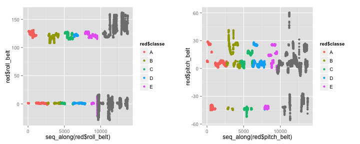

# Introduction
Using a training data set obtained from Velloso *et al.*, a model was trained such that it could recognize the quality of physical training exercises.
*I.e.* the model can recognize if an exercise is carried out according to instructions or not.

# Cleaning Data / Preprocessing
Training and testing data was obtained from the course homepage in raw format.
The data has 160 variables (including the one classification variable `classe` which should be predicted in using the testing data).  
For cross-validated training, the training data was subdivided into a training and a testing set.

```r
inTrain <- createDataPartition(y=training_data$classe, p=0.7, list=FALSE)
training <- training_data[inTrain, ]
testing <- training_data[-inTrain, ]
```
Initial analysis revealed that a number of describing variables were present in the dataset.

```r
training_numeric <- training[sapply(training, is.numeric)]
```
Furthermore, variables specifying only one coordinate (`x`, `y` or `z`) of a feature were discarded.
Finally, only features of `numeric` or `integer` class remained in the `red`uced data set.

```r
red <- training_numeric[ c("roll_belt", "pitch_belt", "yaw_belt", "total_accel_belt",
                           "roll_arm", "pitch_arm", "yaw_arm", "total_accel_arm",
                           "roll_dumbbell", "pitch_dumbbell", "yaw_dumbbell",
                           "total_accel_dumbbell",
                           "roll_forearm", "pitch_forearm", "yaw_forearm",
                           "total_accel_forearm")]
```

The `classe` variable however had to be reattached to the data set.
For an unkown reason, the rebinded `classe` variable had to be renamed.

```r
red <- cbind(red, training[inTrain, "classe"])
colnames(red)[17] <- "classe"
names(red)
```

```
##  [1] "roll_belt"            "pitch_belt"           "yaw_belt"            
##  [4] "total_accel_belt"     "roll_arm"             "pitch_arm"           
##  [7] "yaw_arm"              "total_accel_arm"      "roll_dumbbell"       
## [10] "pitch_dumbbell"       "yaw_dumbbell"         "total_accel_dumbbell"
## [13] "roll_forearm"         "pitch_forearm"        "yaw_forearm"         
## [16] "total_accel_forearm"  "classe"
```

Also it was checked if any `NA` values remained in the data set which would require missing value imputation.

```r
for(i in 1:length(names(red))-1){print(paste(names(red)[i], any(is.na(red[[1]]))))}
```

```
## [1] " FALSE"
## [1] "roll_belt FALSE"
## [1] "pitch_belt FALSE"
## [1] "yaw_belt FALSE"
## [1] "total_accel_belt FALSE"
## [1] "roll_arm FALSE"
## [1] "pitch_arm FALSE"
## [1] "yaw_arm FALSE"
## [1] "total_accel_arm FALSE"
## [1] "roll_dumbbell FALSE"
## [1] "pitch_dumbbell FALSE"
## [1] "yaw_dumbbell FALSE"
## [1] "total_accel_dumbbell FALSE"
## [1] "roll_forearm FALSE"
## [1] "pitch_forearm FALSE"
## [1] "yaw_forearm FALSE"
## [1] "total_accel_forearm FALSE"
```
The working data set for training was now prepared.

# Exploratory Analysis
Exploratory analysis was carried out but the findings are not conclusive.

 

The fact that the `classe`s are separated by the sequence index might indicate that a time variable is present.
This is indeed also stated in the data set description given by the study authors but is not further studied.

# Model Building and Prediction
The model built for classification was based on training with random forest classification, cross-validation was done using the `trControl=trainControl(method="cv", number=25)` argument to the `train` function.

```r
# Preprocess and train.
if(file.exists("./modelFitPrepCVRF.rda"))
{ 
    load("./modelFitPrepCVRF.rda")
} else {
    modelFitPrepCVRF <- train(classe ~ .,
                              data=red,
                              preProcess=c("center", "scale"),
                              trControl=trainControl(method="cv", number=25),
                              method="rf")
    save(modelFitPrepCVRF, file="./modelFitPrepCVRF.rda")
}
```
It is important to note that preprocessing by `center` and `scale` is required, otherwise training does not converge.
The accuracy of 25-fold cross-validating model using a random forest training and `mtry` of 9 was around 0.96.

```r
modelFitPrepCVRF
```

```
## Random Forest 
## 
## 13737 samples
##    16 predictor
##     5 classes: 'A', 'B', 'C', 'D', 'E' 
## 
## Pre-processing: centered, scaled 
## Resampling: Cross-Validated (25 fold) 
## 
## Summary of sample sizes: 9215, 9213, 9214, 9214, 9214, 9215, ... 
## 
## Resampling results across tuning parameters:
## 
##   mtry  Accuracy  Kappa   Accuracy SD  Kappa SD
##    2    0.9676    0.9590  0.008782     0.01114 
##    9    0.9698    0.9618  0.008432     0.01067 
##   16    0.9629    0.9531  0.010337     0.01307 
## 
## Accuracy was used to select the optimal model using  the largest value.
## The final value used for the model was mtry = 9.
```

The error rate for new data (= out of sample error) is calculated as

```r
modelFitPrepCVRF$finalModel
```

```
## 
## Call:
##  randomForest(x = x, y = y, mtry = param$mtry) 
##                Type of random forest: classification
##                      Number of trees: 500
## No. of variables tried at each split: 9
## 
##         OOB estimate of  error rate: 2.96%
## Confusion matrix:
##      A    B    C    D    E class.error
## A 2700   35    1    0    1     0.01352
## B   60 1749   11   18    0     0.04842
## C    1   10 1633   34    5     0.02971
## D    1   24   24 1554    9     0.03598
## E    0    0    1   49 1679     0.02892
```
to be around 2.96 %.
